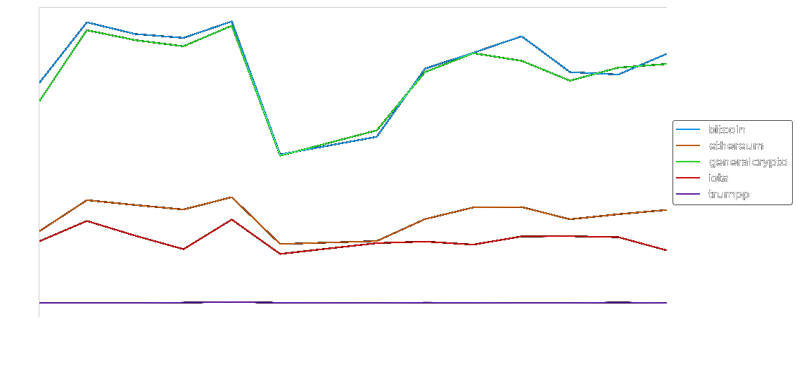

@title[Title]

# CryptoCrawler

#### Mining information about Crypto-Currencies from the Web.
<br>
<div class="byline">by Holger Büch & Kevin Hendel</div>
<br>
<div class="hdm-module">
Module "Web & Social Media Analytics"<br>
by Prof. Dr. Stephan Wilczek, Prof. Dr. Jan Kirenz<br>
Master Data Sciene & Business Analytics<br>
University of Media Stuttgart, Germany<br>
</div>

---
@title[Markdown Syntax Demo]

# Headline 1
## Headline 2
### Headline 3
#### Headline 4
##### Headline 5

Text <span class="pink">with pink</span> and **bold**, *italic* and normal words and a [Link](https://github.com).

- Numeration A
- Numeration B
    - Sub Numeration A
    - Sub Numeration B

+++
@title[Markdown Syntax Demo]

### Source Code

Some Code Examples:

`Single Code line`

```python
if self.mute is not True:
    logger.info('Receiving tweets...')
    self.mute = True
```

+++
@title[Markdown Syntax Demo]

### Color Scheme for Background
- #2779CC
- #D66216
- #CCA91F
- #00A91F

---
@title[Planning the Project]

#### Projekt Preparation
# Planning

+++
@title[Goal]

#### Goal
- Topic: Hype on Crypto-Currencies
- Idea A: Correlate development of Tweets and Stock-Values over time.
- Idea B: Provide additional information, that helps to interpret those developments.
- Idea C: Automatically buy/sell stocks based on prediction. (not done)

+++
@title[Data Sources]

#### Data Sources
- Twitter Stream
- Crypto-Stock-Market Stream
- News

+++
@title[KPIs]

#### KPIs
- Correlation coefficent between Stock-Values and (Sentiment of) Tweets
- Delay between events in Stock-Values and on Twitter

+++
@title[Setup]
#### Project Setup
**Github** for collaboration
- Feature Branches & Pull requests
- Ticketing / Bugs Tracking
- Slides (gitpitch)

**AWS** for Hosting
- t2.medium running Ubuntu
- Access via SSH

**Architecture**
- Docker based Microservices

--- 
@title[Architecture]

#### Architecture
# Docker based Microservices

+++
@title[Docker]

#### Docker
- to do (Container, Docckerfile,..)

+++
@title[Microservices]

#### Microservices
- to do (stateless, independent,...)

+++
@title[In Action]

#### In Action
- to do (Build, Run, Docker-Compose)

---?image=assets/bg-mongodb.png
@title[Microservice - MongoDB]

#### Microservice 1
# Mongo DB

+++
@title[MongoDB]

#### MongoDB
- Document based Database
- A Document contains a JSON object
- Multiple Documents grouped to Collections
- Database can be queried

+++ 
@title[Docker Setup]

#### Docker Setup
- Official MongoDB Image
- Persist Data in local path
- Allow connections from other Containers

+++
@title[Problem with Speed]

#### Problem 1
- Slow (CPU-eating) on Queries over Timestamp

#### Solution
- Create Index on Timestamp Attribute
- Aggregate in DB, where possible

+++
@title[Problem with Aggregation]

#### Problem 1
- MongoDB can aggregate DateTime-Object on Intervals.
- But we get Timestamps in Milliseconds from Twitter.
- How to aggregate Milliseconds?

#### Solution A
- Create & store DateTime value

#### Solution B
- Use Math

---?image=assets/bg-twitterlistener.png
@title[Twitter Stream Listener]

#### Microservice 2
# Twitter Stream Listener

+++

@title[Twitter Stream - Information overload]

#### Problem 1: Too much information

Over <span class="pink">500 MB</span> Data during first two hours.

Over <span class="pink">6000 Tweets</span> every ten minutes:


+++

@title[Twitter Stream - Information overload - solution]

#### Solution

Limit Stored attributes

Limit stored Tweets
- Exclude everything not EN
- Exclude Retweets

+++

@title[Twitter Stream - Bug]

#### Problem 2: Bug in Tweepy Module
```
File "tstreamer.py", line 109, in
myStream.userstream("with=following")
File "/mnt/d5ddf659-feb7-4daf-95c6-09797c84aa98/venvs/python2ds/lib/python2.7/site-packages/tweepy/streaming.py", line 394, in userstream
self._start(async)
File "/mnt/d5ddf659-feb7-4daf-95c6-09797c84aa98/venvs/python2ds/lib/python2.7/site-packages/tweepy/streaming.py", line 361, in _start
self._run()
File "/mnt/d5ddf659-feb7-4daf-95c6-09797c84aa98/venvs/python2ds/lib/python2.7/site-packages/tweepy/streaming.py", line 294, in _run
raise exception
AttributeError: 'NoneType' object has no attribute 'strip'
```
https://github.com/tweepy/tweepy/issues/869 (open since March 2017)

+++

@title[Twitter Stream - Bug - Solution]

#### Problem 2: Bug in Tweepy Module
Try older Version: `conda install -c conda-forge -y tweepy=3.2.0`
Didn't work.
Workaround:
Auto-restart on exit:
`while true; do python streamlistener.py; done`

---

#### No more <span class="gray">Keynote</span>.
#### No more <span class="gray">Powerpoint</span>.
<br>
#### Just <span class="gold">Markdown</span>.
#### Then <span class="gold">Git-Commit</span>.

---?code=assets/md/hello.md&title=Step 1. PITCHME.md

<br>
#### Create slideshow content using GitHub Flavored Markdown in your
favorite editor.

<span class="aside">It's as easy as README.md with simple
slide-delimeters (---)</span>

---

@title[Step 2. Git-Commit]

### <span class="gold">STEP 2. GIT-COMMIT</span>
<br>

```shell
$ git add PITCHME.md
$ git commit -m "New slideshow content."
$ git push

Done!
```

@[1](Add your PITCHME.md slideshow content file.)
@[2](Commit PITCHME.md to your local repo.)
@[3](Push PITCHME.md to your public repo and you're done!)
@[5](Supports GitHub, GitLab, Bitbucket, GitBucket, Gitea, and Gogs.)

---

@title[Step 3. Done!]

### <span class="gold">STEP 3. GET THE WORD OUT!</span>
<br>

<br>
<br>
#### Instantly use your GitPitch slideshow URL to promote, pitch or
present absolutely anything.

---

@title[Slide Rich]

### <span class="gold">Slide Rich</span>

#### Code Presenting for Blocks, Files, and GISTs
#### Image, Video, Chart, and Math Slides
#### Multiple Themes with Easy Customization
<br>
#### <span class="gold">Plus collaboration is built-in...</span>
#### Your Slideshow is Part of Your Project
#### Under Git Version Control within Your Git Repo

---

@title[Feature Rich]

### <span class="gold">Feature Rich</span>

#### Present Online or Offline
#### With Speaker Notes Support
#### Print Presentation as PDF
#### Auto-Generated Table-of-Contents
#### Share Presentation on Twitter or LinkedIn

---

### <span class="gold">GitPitch Pro - Coming Soon!</span>

<br>
<div class="left">
    <i class="fa fa-user-secret fa-5x" aria-hidden="true"> </i><br>
    <a href="https://gitpitch.com/pro-features" class="pro-link">
    More details here.</a>
</div>
<div class="right">
    <ul>
        <li>Private Repos</li>
        <li>Private URLs</li>
        <li>Password-Protection</li>
        <li>Image Opacity</li>
        <li>SVG Image Support</li>
    </ul>
</div>

---

### Go for it.
### Just add <span class="gold">PITCHME.md</span> ;)