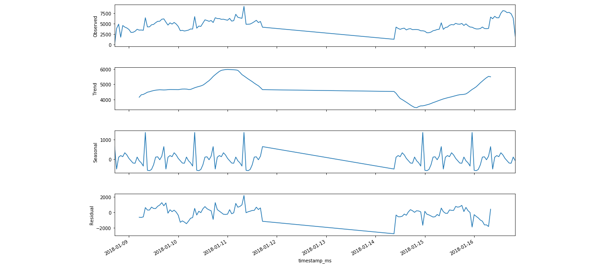
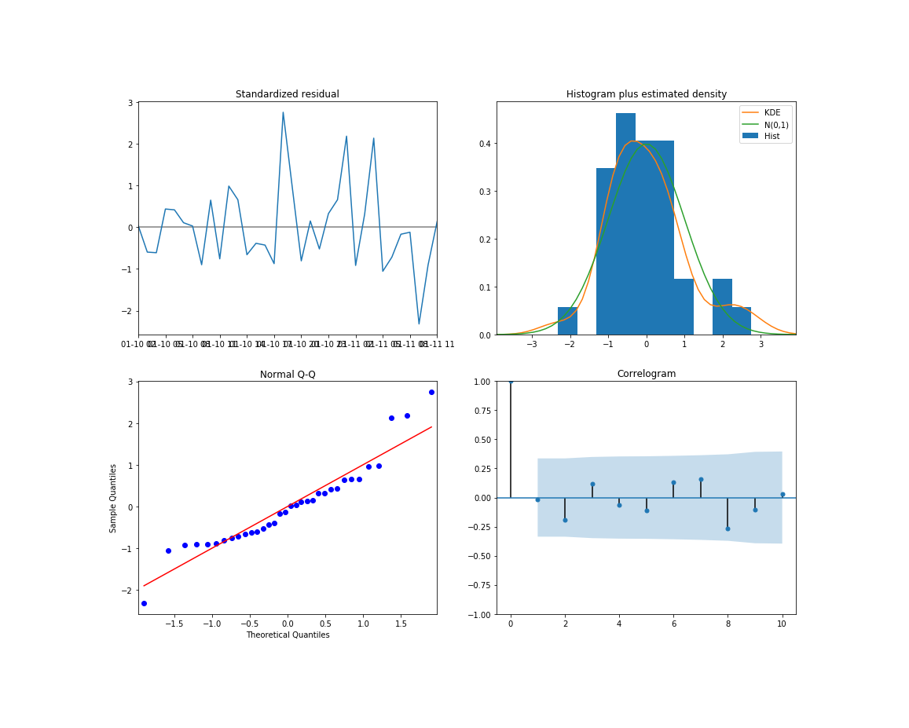
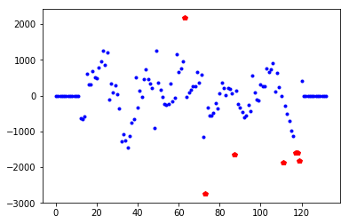

@title[Title Slide]

# CryptoCrawler

#### Mining information about Crypto-Currencies from the Web.
<br>
<div class="byline">by Holger Büch & Kevin Hendel</div>
<br>
<div class="hdm-module">
Module "Web & Social Media Analytics"<br>
by Prof. Dr. Stephan Wilczek, Prof. Dr. Jan Kirenz<br>
Master Data Sciene & Business Analytics<br>
University of Media Stuttgart, Germany<br>
</div>


---
@title[Introduction]

#### Introduction
# Idea & Planning

Kevin


+++
@title[Goal]

#### Goal
- Topic: Hype on Crypto-Currencies
- Idea A: Correlate development of Tweets and Stock-Values over time.
- Idea B: Provide additional information, that helps to interpret those developments.
- Idea C: Automatically buy/sell stocks based on prediction. (not done)


+++
@title[Data Sources]

#### Data Sources
- Twitter Stream
- Crypto-Stock-Market Stream
- News


+++
@title[KPIs]

#### KPIs
- Correlation coefficent between Stock-Values and (Sentiment of) Tweets
- Delay between events in Stock-Values and on Twitter


+++
@title[Setup]
#### Project Setup
**Github** for collaboration
- Feature Branches & Pull requests
- Ticketing / Bugs Tracking
- Slides (gitpitch)

**AWS** for Hosting
- t2.medium running Ubuntu
- Access via SSH

**Architecture**
- Docker based Microservices


---
@title[Architecture]

#### Architecture
# Docker based Microservices

Kevin


+++
@title[Docker]

#### Docker
- Virtualized Containers for each Microservice
-

+++
@title[Microservices]

#### Microservices
- to do (stateless, independent,...)


+++
@title[In Action]

#### In Action
- to do (Build, Run, Docker-Compose)


---?image=assets/bg-mongodb.png
@title[Microservice - MongoDB]

#### Microservice 1
# Mongo DB


+++
@title[MongoDB]

#### MongoDB
- Document based Database
- A Document contains a JSON object
- Multiple Documents grouped to Collections
- Documents can be queried using JSON-based Syntax


+++
@title[Store Documents]

#### Storing Documents with Python

```query
from pymongo import MongoClient

client = MongoClient('crypto-mongo', 27017)
db = client['cryptocrawl']

json_obj = {
    'timestamp_ms': 1517343098,
    'text': 'Something...'
    }

db['bitcoin'].insert(json_obj)
```
@[1](Import Module (has to be installed))
@[3](Initialize Client-Connection to MongoDB)
@[4](Select Database)
@[6-9](MongoDB ♥ JSON Documents)
@[11](Write JSON as Document in a Collection)


+++
@title[Query Documents]

#### Query Documents with Python

```python
import pandas
from pymongo import MongoClient

client = MongoClient('crypto-mongo', 27017)
db = client['cryptocrawl']

query = {'timestamp_ms': {'$gt': 1517343098}}
projection = {'text': 1, 'timestamp_ms': 1}

cursor = db['bitcoin'].find(query, projection).limit(100)

df = pandas.DataFrame(list(cursor))
```
@[1-5](Import Module, Initialize Client-Connection to MongoDB)
@[7](Define Filter (similar to WHERE in SQL))
@[8](Define Fields to return (similar to SELECT in SQL))
@[10](find() returns a cursor object (here also limited to 100 results))
@[12](Cursor can be converted into list and transformed into Pandas Dataframe)

<p class="fragment pink center">
*Show in Robo RT*
</p>


+++
@title[Problems]

## Problems
# <span class="pink">⚔</span>


+++
@title[Problem with Speed - 1]

#### <span class="pink">⚔</span> Slow Queries over Timestamp
- We often query for a specified Range in the Timestamp, e.g:
```python
query = {'timestamp_ms': {'$gt': 1517243098, '$lt': 1517343098}}
```
- Performance was weak
- CPU-Usage on VM peaked


+++
@title[Problem with Speed - 2]

#### <span class="pink">✓</span> Create Index on Timestamp attribute

```shell
$ mongo
Mongo > use cryptocrawl
Mongo > show collections
> bitcoin
> ethereum
> generalcrypto
> iota
Mongo > db.bitcoin.createIndex({"timestamp_ms": 1}, {background:true})
Mongo > db.collection.totalIndexSize()
```

@[1](Start MongoDB CLI client)
@[2](Open Database with Name "cryptocrawler")
@[3-7](List all Collections of this DB)
@[8](Create Index on Attribute 'timestamp_ms'. Repeat for all Collections.)
@[9](Show Size of Indexes. Should fit in RAM.)
@[0-9]()

+++
@title[Problem with Aggregation - 1]

#### <span class="pink">⚔</span> Aggregate by Timestamp in Milliseconds
- We need to aggregate on Time-Intervals, e.g. for Tweets per Hour
- MongoDB can aggregate DateTime-Object on Intervals
- But we get Timestamps in Milliseconds from Twitter
- How to aggregate Integer with Milliseconds on hourly Interval?

+++
@title[Problem with Aggregation - 2]

#### <span class="pink">✓</span> Aggregate using Math
- To aggregate Milliseconds by Hours, get Milliseconds per Hour: |
```
1 Hour is 1000ms * 60sec * 60min = 3.600.000 ms
```
- Then divide Timestamp by this Value and round to floor: |
```
floor (timestamp / 3.600.000)
```
- All Timestamps from the same Hour will result in the same Value |
- Then Aggregation can be done on this Value |
- Sadly, MongoDB has no floor-Function |
- Luckily, it has a modulo- Function: |
```
timestamp/3.600.000 – ( (timestamp/3.600.000) mod 1)
```

+++
@title[Problem with Aggregation - 3]

#### <span class="pink">✓</span> Alternative Solutions
- Cast to DateTime during Query
- Convert & store Milliseconds as DateTime-Value

*Would those be faster?*


---?image=assets/bg-twitterlistener.png
@title[Twitter Stream Listener]

#### Microservice 2
# Twitter Stream Listener


+++
@title[Tweepy]

#### Using Tweepy to listen to Twitter Streaming API

```python
import tweepy

class MyStreamListener(tweepy.StreamListener):
    def on_status(self, status):
        print(status.text)  # Then store the tweets...
    def on_error(self, status_code):
        if status_code == 420:
            time.sleep(300) # Then reconnect ...

auth = tweepy.OAuthHandler(api_key, api_secret)
auth.set_access_token(access_token, access_secret)
api = tweepy.API(auth)

stream_listener = MyStreamListener(conf=conf)
stream = tweepy.Stream(auth=api.auth, listener=stream_listener)
stream.filter(track=list(['bitcoin','iota','...']), async=True)
```
@[1](Import Module)
@[3](Inherit StreamListener class)
@[4-5](Define what to do if tweet arrives)
@[6-8](Handle API Error, especially 420 to avoid penalty)
@[10-13](Set credentials and create API object)
@[15-18](Instanciate class, start listening to Tweets with keywords)
@[0-18]()


+++
@title[Problems]

## Problems
# <span class="pink">⚔</span>


+++
@title[Information overload - 1]

#### <span class="pink">⚔</span> Too much information

- Over <span class="pink">500 MB</span> Data during first two Hours.
- Over <span class="pink">900 Tweets</span> per Minute


*Tweets per 15min, only crypto topics*

+++
@title[Information overload - 2]

#### <span class="pink">✓</span> Filter Tweets
- Exclude non-English Tweets
- Exclude Retweets

<br><br>

#### <span class="pink">✓</span> Store subset of Attributes
- TweetID
- AuthorID
- Text
- Timestamps
- Geo-Information

+++
@title[Tweepy Bug - 1]

#### <span class="pink">⚔</span> Bug in Tweepy Module

Tweepy kept raising Exceptions after some Days of running:

```
File "tstreamer.py", line 109, in myStream.userstream("with=following")
File "/tweepy/streaming.py", line 394, in userstream
self._start(async)
File "/tweepy/streaming.py", line 361, in _start
self._run()
File "/tweepy/streaming.py", line 294, in _run
raise exception
AttributeError: 'NoneType' object has no attribute 'strip'
```

https://github.com/tweepy/tweepy/issues/869 *(open since March 2017)*


+++
@title[Tweepy Bug - 2]

#### <span class="pink">✓</span> Implement Workaround
Handle Exceptions and reconnect Tweepy:

```python
def startListening():
    """Start listening to twitter streams."""
    try:
        stream_listener = MyStreamListener(conf=conf)
        # [...]
    except Exception as e:
        logger.error('Exception raised!', e)
        startListening()
```

Auto-restart Microservice on exit (just in case...):

```bash
while true; do python streamlistener.py; done
```


---?image=assets/bg-pricecrawler.png
@title[Microservice - Price Crawler]

#### Microservice 3
# Crypto Price Crawler

Kevin


---?image=assets/bg-cryptowrapper.png
@title[Microservice - API Wrapper]

#### Microservice 4
# Crypto API Wrapper

Kevin


---?image=assets/bg-anomaly.png
@title[Microservice - Anomaly Detection]

#### Microservice 5
# Anomaly Detection


+++
@title[Idea]

#### Detect 'unusual' Events in:
- Amount of Tweets received
- Sentiment
- Prices of Crypto-Currencies

<br><br>

#### Use this information for:
- Visualization in Dashboard
- Easing the Interpretation of the Data
- Searching for News in those Time-Ranges *(not done)*

+++
@title[Method]

#### Method
- Research on Algorithms |
- Tested ARIMA Model first (in Jupyter Notebook) |
- Data doesn't cover a Time-Span long enough |
- Twitter itself published an Algorithm |
- Implemented only in R (Python-Versions are creepy) |
- Solution: Implement very simplified Version |

<span class="fragment">[Twitter's Algorithm explained ](https://blog.twitter.com/engineering/en_us/a/2015/introducing-practical-and-robust-anomaly-detection-in-a-time-series.html)</span>

+++
@title[Step 1]

#### <span class="pink">Step 1:</span> Seasonal Decomposition



+++
@title[Step 2]

#### <span class="pink">Step 2:</span> Extreme Studentized Deviate test (ESD)
Detect Outliers in univariant Data that is approx. normal distributed *(had to be tested before!)*.

<br>

- Set Parameter for Maximal Outliers |
- Set Parameter for Significance p |
- ESD test detects 1 largest Outlier |
- Calculates Coefficient |
- ESD test detects 2 largest Outliers |
- Calculates Coefficient |
- ... |
- Optimal Number of Outliers selected by Coefficient |

+++
@title[Results]

#### Test for normal distribution



*(Tested already during ARIMA Modelling approach)*


+++
@title[Results]

#### Results of ESD Test
```
Number of outliers:  7
Indices of outliers:  [73, 63, 111, 119, 87, 117, 118]
        R      Lambda                   R      Lambda
 1   3.92406   2.85719          6   2.82568   2.84412
 2   3.36138   2.85462          7   2.92393   2.84144
 3   2.95692   2.85203          8   2.76510   2.83873
 4   2.96757   2.84941          9   2.51757   2.83600
 5   2.80918   2.84678          10  2.54265   2.83325
```




+++
@title[Implementation in Python]

#### Implementation in Python
```python
import statsmodels.api as sm
from PyAstronomy import pyasl

# Seasonal Decomposition
model = sm.tsa.seasonal_decompose(ary, freq=freq)
resid = model.resid

# [...] clean/transform resid values

# ESD
anomalies = pyasl.generalizedESD(resid, max_anoms, p_value)
```
@[1-2](Load Modules)
@[4-5](Seasonal Decompositon)
@[6](We only need resid Values)
@[8](Some Transformation for next Step (e.g. remove NaN))
@[10-11](Apply ESD)
@[0-11]()

<p class="fragment">Whole thing wrapped as Flask API <span class="pink">(<i>Show in Postman</i>)</span></p>


---?image=assets/bg-topic.png
@title[Microservice - Topic Modelling]

#### Microservice 6
# Topic Modelling


+++
@title[Idea]

#### Identify Topics in Tweet-Texts
- Aggregated view on what the Tweets are about
- Add Information to Dashboard
- Search for those Topics in a News API *(not done)*


+++
@title[Method]

#### Latent Dirichlet Allocation (LDA)
- A "Document" contains some Topics with different Weights |
- A "Topic" is Probability Distribution about all Words in Corpus |
- A "Word" can be assigned to more than one Topics |

<span class="fragment">Does this work for such short Documents like Tweets? Lets try!</span>


+++
@title[Preprocessing]

#### Preprocessing
```python
exclude_custom = '“”…‘’x'
exclude = set(string.punctuation + exclude_custom)

stop_custom = ['rt', 'bitcoin', 'bitcoins', 'iota', 'ethereum', 'btc',
               'eth', 'iot', 'ltc', 'litecoin', 'litecoins', 'iotas',
               'ltc', 'cryptocurrency', 'crypto', 'cryptocurrencies',
               'coin']
stop = set(stopwords.words('english') + stop_custom)

# Remove punctuation
doc = ''.join(ch for ch in doc
                      if ch not in exclude)

# Remove URLS
doc = ' '.join([i for i in doc.lower().split()
                      if not i.startswith('http')])

# Remove anything containing numbers
doc = ' '.join([i for i in doc.lower().split()
                      if not any(char.isdigit() for char in i)])

# Remove short words
doc = ' '.join([i for i in doc.lower().split()
                      if len(i) >= 4])

# Lemmatize
# clean_doc = ' '.join(lemma.lemmatize(word)
#     for word in clean_doc.split())

# Remove Stopwords
doc = ' '.join([i for i in doc.lower().split()
                      if i not in stop])
```
@[1-2](Define Chars to remove)
@[4-8](Define Stopwords)
@[10-12](Remove Punctuation and special Chars)
@[14-16](Remove URLs)
@[18-20](Remove Words containing Numbers)
@[22-24](Remove Words below 4 Chars)
@[26-28](Lemmatize (did not work because of uncommon Words))
@[30-32](Remove Stopwords)
@[0-32]


+++
@title[LDA in Python]

#### LDA in Python
```python
import gensim
from gensim import corpora

dictionary = corpora.Dictionary(docs)

doc_term_matrix = [dictionary.doc2bow(doc) for doc in docs]

Lda = gensim.models.ldamodel.LdaModel
ldamodel = Lda(doc_term_matrix, num_topics=num_topics,
               id2word=dictionary, passes=20)

# [...] Converts LDA model into nice list
```
@[1-2](Import Gensim Modul for Vector Space Modelling)
@[4](Load Documents into Corpora Dictionary)
@[6](Prepare Document Term Matrix)
@[8-10](Do Modelling with Parameter for Number of Topics and Passes used)
@[12](Convert Results into consumable List)
@[0-12]()

<p class="fragment">Whole thing wrapped as Flask API <span class="pink">(<i>Show in Postman</i>)</span></p>


---?image=assets/bg-jupyter.png
@title[Microservice - Jupyter Notebook]

#### Microservice 7
# Jupyter Notebook

Kevin


---?image=assets/bg-dash.png
@title[Microservice - Dash]

#### Microservice 8
# Dashbord


+++
@title[Step 3. Done!]

### <span class="gold">STEP 3. GET THE WORD OUT!</span>
<br>

<br>
<br>
#### Instantly use your GitPitch slideshow URL to promote, pitch or
present absolutely anything.


---
@title[Wrap up]

# Wrap up

+++
@title[What we have learned]

#### What we have learned
- Plotly Dash is nice, but Data Management & Cross-Selection is quite difficult.
- Take more care about Exception Handling, especially for critical Services (e.g. Stream Listener)
- Docker(-Compose) is really cool for Development & Deployment!
- Putting the right Data into Models is crucial (e.g. Missing Data in Anomaly-Detection)
- Choosing the right Model for the Data is not easy (e.g. LDA for Tweets)


+++
@title[What we would improve]

#### What we would improve (1)
<div class="fragment">
<p><b class="pink">Architecture & Code</b></p>
<ul>
<li>Connect Frontend through only one single API</li>
<li>Refactor Dashboard-Code</li>
</ul>
</div>

<div class="fragment">
<p><b class="pink">Topic Modelling</b></p>
<ul>
<li>Search for a better Model for short Texts</li>
<li>Research, if LDA can be speed up somehow</li>
</ul>
</div>

<div class="fragment">
<p><b class="pink">Anomaly Detection</b></p>
<ul>
<li>More complete Twitter Algorithm Implementation</li>
<li>Or build R Microservice</li>
</ul>
</div>


+++
@title[What we would improve]

#### What we would improve (2)
<div class="fragment">
<p><b class="pink">Dashboard UX / UI</b></p>
<ul>
<li>Non blocking Interactions</li>
<li>Add loading Indicators</li>
<li>Improve Cross-Selection</li>
<li>Improve Performance, e.g. on Data-Loading</li>
</ul>
</div>

<div class="fragment">
<p><b class="pink">Additional Features</b></p>
<ul>
<li>Leverage News APIs</li>
<li>Calculate and display Correlation Coefficent</li>
<li>Show Tweets on Map</li>
</ul>
</div>


---
@title[Thank you!]

# <span class="pink">☺</span>

### Thank you for your Attention!
